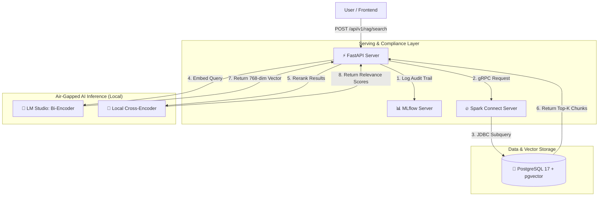

# 🏦 Enterprise BFSI RAG Architecture: Air-Gapped, Compliant, and Scalable

[](https://www.python.org/downloads/)
[](https://spark.apache.org/docs/3.5.1/)
[](https://www.postgresql.org/)

## 📖 Executive Summary

Retrieval-Augmented Generation (RAG) is transforming how enterprises interact with data. However, in highly regulated sectors like Banking and Financial Services (BFSI), standard "toy" RAG implementations fail due to strict data privacy laws, the risk of AI hallucinations, and the lack of regulatory audit trails.

This project delivers a **production-grade, air-gapped, and fully compliant RAG architecture** designed specifically for BFSI use cases. It solves the "dumb vector search" problem using Two-Stage Retrieval, ensures zero data leakage via local LLM inference, and satisfies SR 11-7 Model Risk Management compliance through immutable MLflow audit logging.

## 🏗️ System Architecture



## 🌟 Key Features & Highlights

### 🛡️ Enterprise Compliance & Security
* **Air-Gapped Inference:** Uses LM Studio for local Bi-Encoder and Cross-Encoder inference. Financial data **never** leaves the local environment.
* **SR 11-7 Audit Trails:** Every API request automatically logs the user query, retrieved context, model versions, and timestamps to MLflow as immutable JSON artifacts.
* **PII Masking:** PySpark pipelines include SHA-256 hashing for sensitive financial data before ingestion.

### 🧠 Advanced AI & Retrieval
* **Two-Stage Retrieval:** Combines lightning-fast Bi-Encoder vector search (pgvector) with a highly accurate Cross-Encoder reranker to solve nuanced financial context (e.g., distinguishing "cash flow struggle" from "no money").
* **Native Vector Storage:** Leverages PostgreSQL 17 with the `pgvector` extension as the single source of truth, avoiding niche, unapproved vector databases.

### ⚙️ Scalable Data Engineering
* **Decoupled Compute:** FastAPI acts as a lightweight client, communicating via gRPC to a dedicated Spark Connect server. This allows independent scaling in Kubernetes.
* **Pushdown Optimization:** Complex cosine distance calculations are pushed down to PostgreSQL, keeping Spark's memory footprint minimal.
* **Universal Analytics Stack:** Includes Jupyter, Scikit-Learn, and XGBoost for seamless transition from EDA to production deployment.

## 🛠️ Technology Stack

| Category | Technologies |
| :--- | :--- |
| **Infrastructure** | WSL2, Docker, Docker Compose |
| **Data Engineering** | PySpark 3.5.1, PostgreSQL 17, pgvector |
| **AI / Machine Learning** | LM Studio, SentenceTransformers (Cross-Encoder), Nomic Embed |
| **API & Serving** | FastAPI, Uvicorn, Pydantic, Spark Connect (gRPC) |
| **MLOps & Compliance** | MLflow (Experiment Tracking & Model Registry) |
| **EDA & Visualization** | Jupyter Notebooks, Pandas, Matplotlib, Plotly |

## 🚀 Quick Start Guide

### Prerequisites
1. **Docker Desktop** installed and running on Windows/Mac/Linux.
2. **WSL2** (if running on Windows).
3. **LM Studio** installed and running its Local Server on port `1234`.
   * *Required Models:* Load a Bi-Encoder (e.g., `nomic-embed-text`) and ensure the server is active.

### 1. Clone and Build
```bash
git clone https://github.com/YOUR_USERNAME/Predictive_Analytics_Using_PySpark.git
cd Predictive_Analytics_Using_PySpark
docker-compose up -d --build
```

### 2. Prepare the Data
```bash
docker exec -it bfsi_pyspark_dev python /workspace/rag_data_prep.py
```

### 3. Test the API
```bash
curl -X POST "http://localhost:8000/api/v1/rag/search" \
-H "Content-Type: application/json" \
-d '{"query": "Are we allowed to share our financial models with the SEC?", "top_k": 3}'
```

### 4. Access Interfaces
* **FastAPI Docs:** http://localhost:8000/docs
* **MLflow UI:** http://localhost:5000
* **Jupyter:** http://localhost:8888

## 📂 Project Structure

```text
.
├── docker-compose.yml          # Orchestrates Postgres, Spark, MLflow, FastAPI, and Dev env
├── Dockerfile                  # Universal Data Science & Engineering image
├── main.py                     # Production FastAPI + Spark Connect + MLflow Audit logic
├── rag_data_prep.py            # PySpark ETL, Chunking, PII Masking, and Embedding pipeline
├── two_stage_rag_search.py     # Standalone script demonstrating Bi + Cross-Encoder retrieval
├── test_api.http               # PyCharm HTTP Client requests for API testing
└── README.md                   # Project documentation
```

## 📈 Future Roadmap
- [ ] Implement **HNSW Indexing** in `pgvector` for sub-millisecond search at 10M+ rows.
- [ ] Add **Kubernetes (K8s) Helm Charts** for cloud-native deployment.
- [ ] Integrate a **Cross-Encoder Reranker API** to offload scoring from the FastAPI container.
- [ ] Implement **Role-Based Access Control (RBAC)** and JWT authentication for the FastAPI layer.

## 📄 License
This project is licensed under the MIT License - see the LICENSE file for details.

## 🤝 Connect
* **Medium Article Series:** [Link to Part 1]
* **YouTube Walkthrough:** [Link to Video]
* **LinkedIn:** [Your LinkedIn Profile URL]
```

